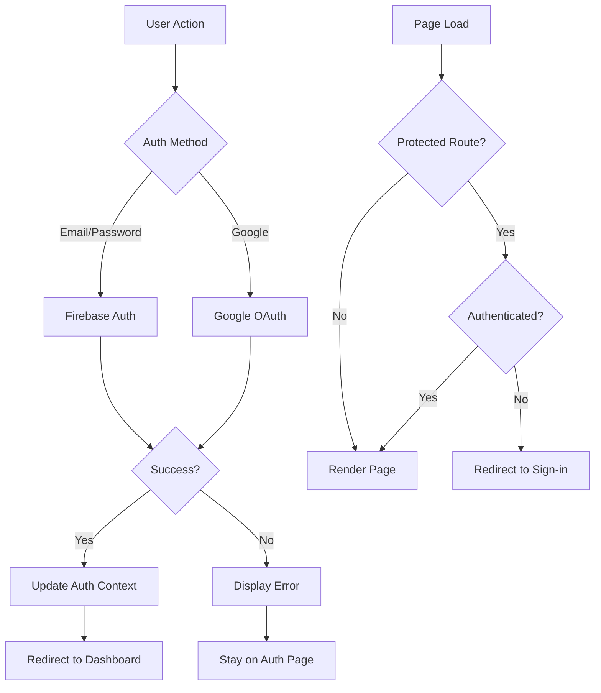
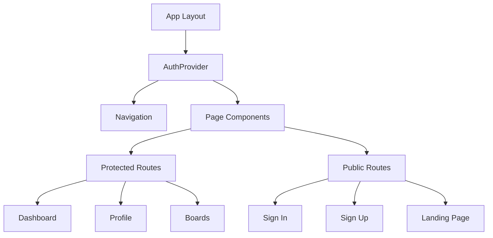

# Design Document

## Overview

This design addresses critical authentication bugs and implements comprehensive testing for the homeschool application. The main issues identified are:

1. Missing authentication methods in the AuthContext
2. Firebase configuration using demo values
3. Incomplete error handling
4. Lack of proper authentication state management
5. Missing protected route functionality

The solution involves fixing the authentication context, implementing proper Firebase configuration, adding comprehensive error handling, and creating a systematic testing approach for all application pages.

## Architecture

### Authentication Flow Architecture



### Component Architecture



## Components and Interfaces

### Enhanced AuthContext Interface

```typescript
interface AuthContextType {
  user: User | null;
  loading: boolean;
  signUp: (email: string, password: string, name: string) => Promise<void>;
  signIn: (
    email: string,
    password: string,
    rememberMe?: boolean
  ) => Promise<void>;
  signInWithGoogle: (rememberMe?: boolean) => Promise<void>;
  signOut: () => Promise<void>;
  resetPassword: (email: string) => Promise<void>;
  updateProfile: (updates: {
    displayName?: string;
    photoURL?: string;
  }) => Promise<void>;
}
```

### Firebase Configuration Service

```typescript
interface FirebaseConfig {
  apiKey: string;
  authDomain: string;
  projectId: string;
  storageBucket: string;
  messagingSenderId: string;
  appId: string;
}

interface FirebaseService {
  isConfigured: boolean;
  validateConfig: () => boolean;
  getErrorMessage: (error: FirebaseError) => string;
  initializeServices: () => Promise<void>;
}
```

### Protected Route Component

```typescript
interface ProtectedRouteProps {
  children: React.ReactNode;
  fallback?: React.ReactNode;
  redirectTo?: string;
}
```

## Data Models

### User Profile Model

```typescript
interface UserProfile {
  uid: string;
  email: string;
  displayName: string;
  photoURL?: string;
  emailVerified: boolean;
  createdAt: Timestamp;
  lastLoginAt: Timestamp;
  preferences: {
    theme: "light" | "dark" | "system";
    notifications: boolean;
    rememberMe: boolean;
  };
}
```

### Authentication Error Model

```typescript
interface AuthError {
  code: string;
  message: string;
  userFriendlyMessage: string;
  retryable: boolean;
  action?: "retry" | "reset-password" | "contact-support";
}
```

## Error Handling

### Error Classification System

1. **Network Errors**: Connection issues, timeouts
2. **Authentication Errors**: Invalid credentials, account issues
3. **Authorization Errors**: Unauthorized domain, permissions
4. **Validation Errors**: Form validation, input errors
5. **Configuration Errors**: Missing environment variables, setup issues

### Error Mapping Strategy

```typescript
const errorMappings = {
  "auth/user-not-found": {
    message: "No account found with this email address.",
    action: "sign-up",
  },
  "auth/wrong-password": {
    message: "Incorrect password. Please try again.",
    action: "reset-password",
  },
  "auth/email-already-in-use": {
    message: "An account with this email already exists.",
    action: "sign-in",
  },
  "auth/weak-password": {
    message: "Password is too weak. Please choose a stronger password.",
    action: "retry",
  },
  "auth/unauthorized-domain": {
    message: "This domain is not authorized. Please contact support.",
    action: "contact-support",
  },
};
```

## Testing Strategy

### Next.js-Specific Testing Approach

1. **Unit Tests**: Jest + React Testing Library for components
2. **Integration Tests**: Test authentication flow with Firebase
3. **E2E Tests**: Playwright for complete user journeys
4. **API Route Tests**: Test Next.js API endpoints
5. **Middleware Tests**: Test authentication middleware
6. **Manual Testing**: Systematic page-by-page testing

### Comprehensive Page Testing Matrix

| Page Category       | Routes                                                                         | Authentication Required        | Test Cases                                            |
| ------------------- | ------------------------------------------------------------------------------ | ------------------------------ | ----------------------------------------------------- |
| **Public Pages**    | `/`, `/about`, `/privacy-policy`, `/terms-of-service`                          | No                             | Load without auth, SEO metadata, responsive design    |
| **Auth Pages**      | `/sign-in`, `/sign-up`, `/reset-password`, `/verify-email`                     | No (redirect if authenticated) | Form validation, Firebase integration, error handling |
| **Protected Pages** | `/dashboard`, `/profile`, `/settings`                                          | Yes                            | Redirect if unauthenticated, user data loading        |
| **Board Pages**     | `/boards`, `/boards/[id]`, `/boards/create`                                    | Yes                            | CRUD operations, permissions, data persistence        |
| **Community Pages** | `/community`, `/community/events`, `/community/groups`, `/community/locations` | Mixed                          | Public viewing, authenticated interactions            |
| **Resource Pages**  | `/resources`, `/resources/[id]`                                                | Mixed                          | Public resources, authenticated creation              |
| **Planner Pages**   | `/planner`                                                                     | Yes                            | Calendar functionality, data persistence              |
| **Admin Pages**     | `/admin`, `/admin/backups`, `/admin/seed-data`                                 | Admin role                     | Role-based access, admin functions                    |
| **API Routes**      | `/api/ai/*`, `/api/backups`, `/api/mapbox-token`                               | Varies                         | Authentication, rate limiting, error handling         |

### Security Testing Scenarios

#### Authentication Security

1. **Password Security**

   - Minimum 8 characters with uppercase and number
   - Password strength validation
   - Secure password hashing (handled by Firebase)
   - Password reset functionality

2. **Session Management**

   - Secure session cookies
   - Session timeout handling
   - Remember me functionality
   - Proper logout clearing

3. **Rate Limiting**
   - Login attempt limiting (5 attempts per 15 minutes)
   - API endpoint rate limiting
   - Account lockout after failed attempts
   - IP-based rate limiting

#### Authorization Testing

1. **Role-Based Access Control**

   - Admin-only pages (`/admin/*`)
   - User-specific data access
   - Resource ownership validation
   - Firestore security rules enforcement

2. **Data Protection**
   - User data isolation
   - Sensitive data encryption
   - PII handling compliance
   - GDPR compliance features

#### Network Security

1. **HTTPS Enforcement**

   - All traffic over HTTPS
   - Secure cookie flags
   - HSTS headers

2. **Content Security Policy**

   - Script source restrictions
   - Image source validation
   - Frame embedding protection
   - XSS prevention

3. **Cross-Origin Protection**
   - CORS policy enforcement
   - CSRF token validation
   - Referrer policy implementation

### Next.js Specific Test Cases

#### Server-Side Rendering (SSR)

1. **Authentication State Hydration**

   - Consistent auth state between server and client
   - No flash of unauthenticated content
   - Proper loading states

2. **Protected Route Middleware**
   - Server-side authentication checks
   - Proper redirects for unauthenticated users
   - Callback URL preservation

#### API Route Security

1. **Authentication Middleware**

   - JWT token validation
   - Firebase Admin SDK integration
   - Proper error responses

2. **Input Validation**
   - Request body validation
   - SQL injection prevention
   - XSS attack prevention

#### Client-Side Security

1. **Environment Variables**

   - Proper separation of public/private vars
   - No sensitive data in client bundle
   - Firebase config validation

2. **Bundle Security**
   - No sensitive keys in client code
   - Proper code splitting
   - Secure dependency management

## Implementation Phases

### Phase 1: Fix Core Authentication

- Implement missing authentication methods in AuthContext
- Fix Firebase configuration validation
- Add proper error handling

### Phase 2: Enhance User Experience

- Implement protected routes
- Add loading states
- Improve error messages

### Phase 3: Comprehensive Testing

- Create systematic testing checklist
- Test all pages and navigation
- Verify authentication flows

### Phase 4: Performance and Security

- Implement authentication persistence
- Add security headers
- Optimize loading performance

## Security Considerations

### Authentication Security

- **Multi-Factor Authentication**: Implement optional 2FA for enhanced security
- **Password Policies**: Enforce strong password requirements (8+ chars, uppercase, numbers)
- **Account Lockout**: Temporary lockout after 5 failed attempts (15-minute duration)
- **Session Security**: Secure HTTP-only cookies with proper expiration
- **Firebase Security Rules**: Comprehensive Firestore and Storage rules

### Data Protection & Privacy

- **Data Encryption**: All sensitive data encrypted at rest and in transit
- **PII Handling**: Proper handling of personally identifiable information
- **GDPR Compliance**: User data export/deletion capabilities
- **Data Minimization**: Collect only necessary user information
- **Audit Logging**: Track all authentication and data access events

### Network Security

- **HTTPS Enforcement**: All traffic over HTTPS with HSTS headers
- **Content Security Policy**: Strict CSP to prevent XSS attacks
- **CORS Configuration**: Proper cross-origin resource sharing policies
- **Rate Limiting**: API endpoint protection against abuse
- **DDoS Protection**: Cloudflare or similar service integration

### Application Security

- **Input Validation**: Server-side validation for all user inputs
- **SQL Injection Prevention**: Parameterized queries and ORM usage
- **XSS Prevention**: Content sanitization and CSP headers
- **CSRF Protection**: Anti-CSRF tokens for state-changing operations
- **Dependency Security**: Regular security audits of npm packages

### Infrastructure Security

- **Environment Variables**: Secure management of secrets and API keys
- **Firebase Security**: Proper configuration of Firebase security rules
- **Monitoring**: Real-time security monitoring and alerting
- **Backup Security**: Encrypted backups with access controls
- **Incident Response**: Documented security incident response procedures

## Performance Considerations

### Loading Optimization

- Lazy load authentication components
- Implement proper loading states
- Cache authentication status
- Minimize Firebase SDK bundle size

### User Experience

- Provide immediate feedback for user actions
- Implement optimistic UI updates
- Handle offline scenarios gracefully
- Maintain responsive design across devices
